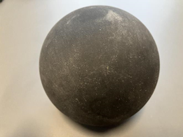
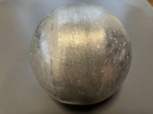
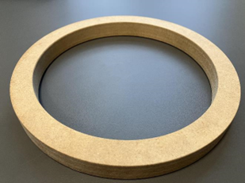
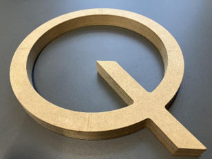
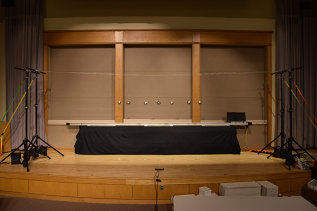
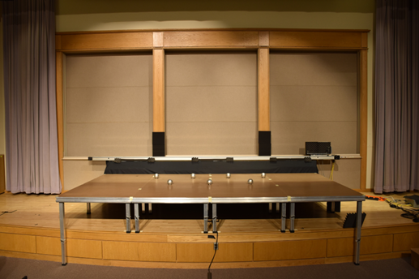
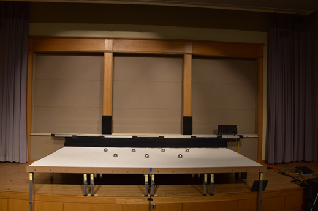
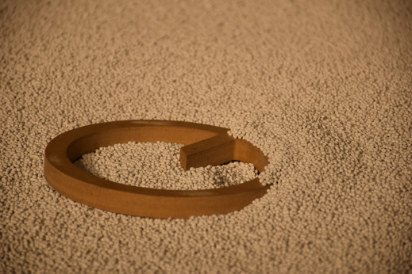
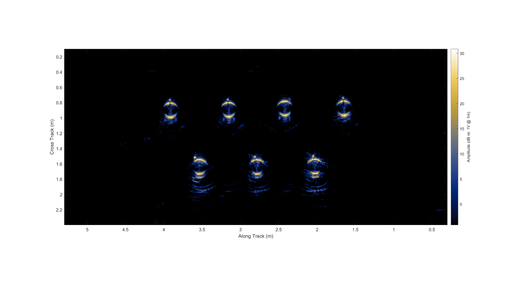

# AirSAS (In-air Synthetic Aperture Sonar)

This code accompanies "In-air synthetic aperture sonar observations of target scattering in environments of varying complexity" by Blanford et al., published in XXX. The paper is available here\: Insert link when available.

## Background 
---
Synthetic aperture sonar (SAS) is a coherent acoustic remote sensing technique that is typically used to produce high resolution images of objects in underwater environments. SAS arrays are mounted to a moving platform, transmit pulses at regular intervals, and record the backscattered echoes on one or more receivers. Using the estimated motion of the platform and an estimate of the local sound speed, these echoes are reconstructed into imagery that is a spatial map of the acoustic reflectivity of the scene. SAS data contains significant physical complexity. Targets have complicated scattering behavior that depends on their shape and material composition. They often lie proud or partially buried on seafloors with multiple scales of roughness and inhomogeneous acoustic properties. Both the raw echoes and the reconstructed imagery contain information about the targets, the environment, and how the two interact with acoustic stimuli.

This data set consists of in-air SAS data of multiple types of targets and backgrounds collected in a controlled, quiet, indoor laboratory environment. The data contains the complex-valued SAS imagery, aswell as the raw acoustic signals and the associated non-acoustic data needed for image reconstruction. Compared to underwater experiments, in-air laboratory data collection allows for simplification of the physical phenomena contributing to a given scene, the ability to build complexity in a controlled manner, and the opportunity for rapid experimental iteration to capture (or remove) and characterize physical effects present in the data. The advantages afforded by in-air experimentation were intended to allow for accurate modeling and quantification of uncertainty in the data that would be infeasible underwater.
 
## Data Organization
---
The data is available at XXXX. The data is organized into two folders\: “scenes” and “characterization data”. Within the “scenes” folder, the acoustic and non-acoustic data from the collection of each scene, along with the reconstructed imagery of the scene, are saved in .h5 files. Each .h5 file contains data from a unique collection of aparticular target and background configuration.

### scenes
---
Within the “scenes” folder, the acoustic and non-acoustic data from the collection of each scene, along with the reconstructed imagery of the scene, are saved in .h5 files. Each .h5 file contains data from a unique collection of a particular target and background configuration.  

The four character prefix in the file name identifies the configuration of the targets and the background. The first two charachters identify the target:


| Target prefix (two characters) | Target | Photo |
| :------------------- | :----------: |  :----------: | 
| t0              | No target      |  |
| t1              | Solid sphere   |  |
| t2              | Hollow sphere  |  |
| t3              | Letter O       |  |
| t4              | Letter Q       |  |

The second two charachters identify the background environment:

| Background prefix (two characters) | Background |  Photo |
| :------------------- | :----------: | :----------: | 
| e1              | Free field       |  |
| e2              | Flat interface   |  |
| e3              | Rough interface  |  |
| e4              | Partially buried in rough interface |  |


A two digit suffix indicates the unique number of the collection. This suffix ranges from 01 to the total number of collections in that configuration. Noise recordings, where no waveform was transmitted in order to characterize the background noise in the experiment, are saved as .h5 files in the same manner using the prefix “noise”. The table below summarizes the naming and quantity of the h5 files in the data set.

| File | Description |  Quantity of files |
| :------------------- | :----------: | :----------: | 
 t0e1_xx.h5 | No target present, free-field | 8 |
 t1e1_xx.h5 | Solid sphere, free-field | 42 |
 t2e1_xx.h5 | Hollow sphere, free-field | 32 |
 t3e1_xx.h5 | Letter O, free-field | 33 |
 t4e1_xx.h5 | Letter Q, free-field | 31 |
 t0e2_xx.h5 | No target present, flat interface | 14 |
 t1e2_xx.h5 | Solid sphere, flat interface | 34 |
 t2e2_xx.h5 | Hollow sphere, flat interface | 34 |
 t3e2_xx.h5 | Letter O, flat interface | 63 |
 t4e2_xx.h5 | Letter Q, flat interface | 53 |
 t0e3_xx.h5 | No target present, rough interface | 32 |
 t2e3_xx.h5 | Hollow sphere, proud on rough interface | 32 |
 t3e3_xx.h5 | Letter O, proud on rough interface | 32 |
 t4e3_xx.h5 | Letter Q, proud on rough interface | 31 |
 t1e4_xx.h5 | Solid sphere, partially buried in rough interface | 32 |
 t2e4_xx.h5 | Hollow sphere, partially buried in rough interface | 32 |
 t3e4_xx.h5 | Letter O, partially buried in rough interface | 36|
 t4e4_xx.h5 | Letter Q, partially buried in rough interface | 35 |
 noise_xx.h5 | Noise recording (no waveform transmission) | 5 |

### characterization data

Additional data from the calibration and characterization of the experiment is stored in the “characterization data” folder. This portion of the dataset includes the electroacoustic calibration of the receive electronics, the directivity measurements of the transducers, measurements of the target coordinates and support lines in the free-field environment, and qualitative notes about collection anomalies.  The contents of this folder are summarized in the table below

| File | Description |  Quantity of files |
| :------------------- | :----------: | :----------: | 
lineLength.csv | Measurements of the lengths of fishing line used to suspend targets in the free-fieldenvironment | m |
targetElevation.csv | Measurements of the elevation of the targets in the free-field environment | m |
targetMass.csv | Measurements of mass of the targets  | kg |
 O.pdf | Dimensioned drawing for the block letter O target | inch |
 Q.pdf | Dimensioned drawing for the block letter Q target | inch |
 notes.csv | Qualitative notes about anyanomalies that occured during each data collection, along with the timestamp of the start of the collection | |
acquistionParams.csv | Properties of the data acquistion system during the acoustic collection | various |
sensorCoordinates.csv | Measured coordinates of the speaker and microphones in the home position | m |
waveformCapture.csv | Recording of the transmitted waveform, sampled at 100kHz | V
speakerPattern.csv | Measured beampattern of the speaker at 10kHz, 20kHz, and 30kHz | dB re\: maximum |
micPattern.csv | Measured beampattern of the channel 1 microphone at 10kHz, 20kHz, and 30kHz | dB re\: maximum |
 micCalibration.csv | Electroacoustic calibration (with uncertainty) of each microphone used in the experiment at 250Hz | VPa^(−1) |
 micFrequencyResponse.csv | Frequency response of each microphone used in the experiment relative to the response at 250Hz | dB re\: 250Hz |
 preampCalibration.csv | Gain calibration of each microphone preamplifier channel | dB re\: input |

## Making a SAS Image

To create a SAS Image, execute the makeSasImage.m script.  When opening the script for the first time, the "folder" and "filename" variables will be empty: 

```matlab
%Specify the path and filename before execution
folder=''; %path to folder containing both \scenes and \characterization data
filename=''; %specific .h5 data file to load
```
The user will need to specify the path to the data set prior to execution. For example\:

```matlab
%Specify the path and filename before execution
folder='./airSAS_ExampleDir'; %path to folder containing both \scenes and \characterization data
filename='t1e1_01.h5'; %specific .h5 data file to load
```

Once the path has been specified, the code can be executed. The script will output an image four each of the four microphone channels. For example, channel 4 for the file 't4e2_06.h5' is shown below\:



